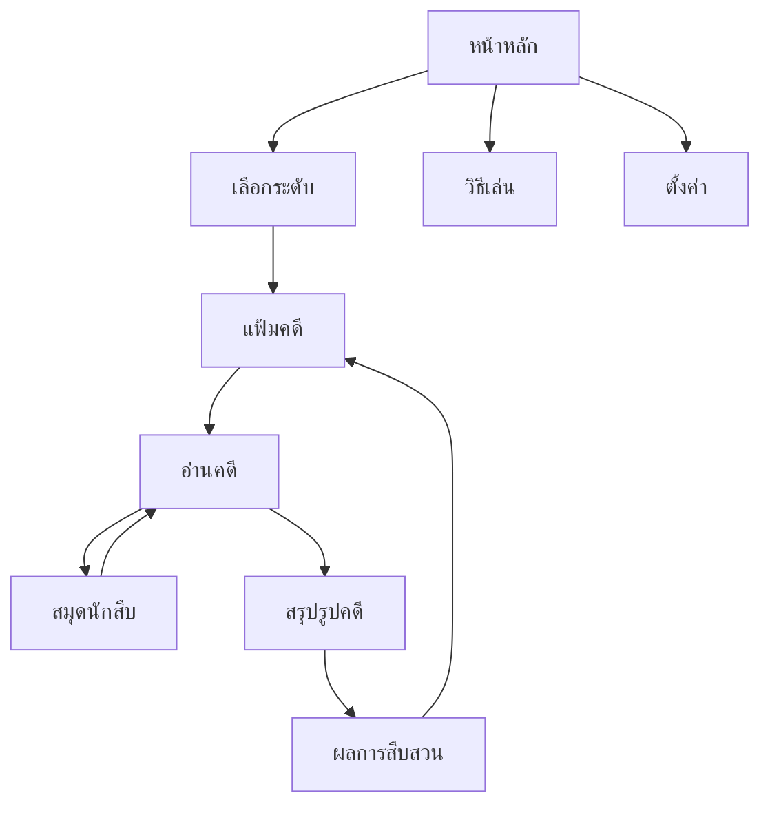

# MurdPuzzle — แผนปรับหน้าตาและประสบการณ์เล่น

วันที่: 5 กันยายน 2026

สถานะ: แผนสำหรับส่งต่อเอเจนต์ ยังไม่ได้แก้ UI หรือระบบเกม

ทิศทางที่ผู้ใช้เลือก: **แฟ้มคดีร่วมสมัย — สว่าง อ่านง่าย มีความลึกลับ ดูเป็นเกมนักสืบ**

พื้นที่ทำงาน: `E:\GIT\MurdPuzzle` — พาธไฟล์ในเอกสารนี้อ้างอิงจากรากโปรเจกต์

## 1. ผลลัพธ์ที่ต้องการ

เปลี่ยนเกมให้รู้สึกเหมือนเปิดแฟ้มคดีบนโต๊ะนักสืบยุคปัจจุบัน: กระดาษสีขาวอุ่น ตัวหนังสือไทยอ่านสบาย เนื้อหาเป็นลำดับ ตารางตรรกะชัด และมีเครื่องมืออยู่ในตำแหน่งที่คาดเดาได้ ผู้เล่นควรรู้ภายในหน้าจอแรกว่าต้องกดอะไร และระหว่างเล่นควรใช้สมาธิกับการเชื่อมเบาะแสเป็นหลัก

การเปลี่ยนต้องเห็นชัดจากโครงหน้า น้ำหนักตัวอักษร องค์ประกอบแฟ้มคดี และการจัดวางเครื่องมือ ไม่ใช่เพียงเปลี่ยนสีปุ่มหรือเพิ่มความโค้งให้การ์ดเดิม

เกณฑ์ภาพรวม:

- หน้าแรกมีปุ่มเริ่มเล่นอยู่เหนือภาพตกแต่งและสถิติบนมือถือ
- อ่านเรื่องยาวและเบาะแสได้โดยไม่รู้สึกว่าทุกประโยคเป็นหัวข้อใหญ่
- หน้าสมุดนักสืบยังแสดงตารางทุกคู่หมวดหมู่ครบตามรูปแบบเดิม
- บนเดสก์ท็อปอ่านเบาะแสควบคู่กับตารางได้ บนมือถือกลับไปอ่านตำแหน่งเดิมได้
- ทุกหน้ารวมถึงคู่มือ ตั้งค่า และหน้าต่างเครื่องมือใช้ระบบภาพชุดเดียวกัน
- คดีเดิม กฎเดิม ลำดับปลดล็อก และข้อมูลบันทึกเดิมยังใช้งานได้

## 2. สิ่งที่สำรวจแล้ว และข้อจำกัดของหลักฐาน

### ตรวจจากไฟล์จริง

- Next.js `16.2.4`, React `19.2.4`, Tailwind CSS 4 ตาม `package.json` มี `dev`, `build`, `start`, `lint` แต่ยังไม่มีคำสั่งทดสอบอัตโนมัติ
- `src/app/page.tsx` เปลี่ยนหน้าด้วย `ScreenState` ได้แก่ MENU, LEVEL_SELECT, CASE_SELECT, GAME, HOW_TO_PLAY, SETTINGS ไม่ใช่ route แยกของแต่ละคดี
- `src/data/allCases.ts` รวมคดีจาก JSON 4 ชุด ชุดละ 25 คดี รวม 100 คดี
- ระดับ 1–2 มี 3 หมวด หมวดละ 3 รายการ ระดับ 3–4 มี 4 หมวด หมวดละ 4 รายการ
- `design.md` มีแนวคิด Mobile Case Reader + Full-screen Detective Notebook อยู่แล้ว และกำหนดให้มือถือเห็นตารางครบ ไม่เปลี่ยนเป็นตัวเลือกคู่หมวด
- `tokens.css` มีระบบสี ระยะ ฟอนต์ และ motion อยู่แล้ว จึงปรับจากฐานนี้ได้
- `src/app/globals.css` ประมาณ 2,000 บรรทัด มี selector เดิมถูกนิยามซ้ำหลายช่วง ทั้ง primitives, hero, notebook และ grid ขณะที่บางหน้ามีกรอบดำ/เงา/ขนาดตัวอักษรกำหนดใน JSX
- อ่านเอกสาร Next.js ที่ติดตั้งจริงเรื่อง CSS และ Font Optimization ใน `node_modules/next/dist/docs/01-app/01-getting-started/` แล้ว

### ตรวจผ่านเบราว์เซอร์ในเครื่อง

- เปิดหน้าแรก → เลือกระดับ → รายการคดี → คดี 01 → สมุดนักสืบ
- ตรวจภาพหน้าอ่านคดีและสมุดนักสืบที่ viewport `390×844`; ตรวจสมุดนักสืบที่ `1440×900`
- ปุ่มเปิดสมุดเป็นไอคอนอย่างเดียว แม้มี accessible label ว่า “เปิดสมุดนักสืบ”; กรอบปุ่มที่วัดได้ 64×64 CSS px
- ตารางคดี 01 ที่ `390×844` มีปุ่มช่องแรกประมาณ 48.4×48.8 CSS px จึง **ไม่ได้พบว่าตารางเล็กทุกระดับ**
- เดสก์ท็อปมีกรอบพื้นที่ตารางกว้างมาก แต่กริดคดีเล็กอยู่ตรงกลาง และไม่มีเบาะแสข้างกริด

### ยังไม่ได้ยืนยัน

- ยังไม่ได้เล่นคดีจนจบ ทดสอบ save/reload, keyboard focus, screen reader หรือทุก modal ครบ
- ยังไม่ได้เปิดคดีระดับ 3–4 ในเบราว์เซอร์ การประเมินความหนาแน่นของกริดใหญ่ด้านล่างอ้างอิงสูตรในโค้ดและโครงข้อมูล
- ยังไม่ได้ทดสอบบนโทรศัพท์จริง Safari/PWA หรือ production build
- คอมเมนต์ใน CSS ที่เขียนว่า mobile/contrast “pass” เป็นข้อความเดิม ไม่ใช่ผลตรวจของรอบนี้
- ไม่ได้รัน lint/build/test รอบนี้ เพราะส่งมอบเป็นเอกสารวางแผน ให้เอเจนต์เก็บ baseline ก่อนลงมือจริง

## 3. ปัญหาที่ควรแก้ตามลำดับ

| ลำดับ | สิ่งที่พบ | ผลต่อผู้เล่น | แนวทางแก้ |
|---|---|---|---|
| 1 | Hero, ภาพตกแต่ง และสถิติมาก่อนปุ่มเริ่มใน `MainMenu.tsx` | ต้องเลื่อนผ่านของตกแต่งก่อนเริ่มเล่น โดยเฉพาะจอเตี้ย | วาง CTA ใน hero เหนือสถิติและภาพ; ลด hero บนมือถือ |
| 2 | กรอบ เงา และสีหลายชุด; CSS override หลายรอบ | หน้าตาไม่ต่อเนื่อง และแก้จุดหนึ่งกระทบอีกหน้าได้ | รวม token และ primitive; ย้าย style เฉพาะส่วนไปใกล้ component |
| 3 | เรื่อง เบาะแส และหัวข้อใช้ตัวหนามาก; ป้ายอังกฤษเล็กหลายจุด | ลำดับสายตาไม่ชัด อ่านไทยต่อเนื่องเหนื่อย | Body 400–500, heading 600–700, ป้ายภาษาไทย และ metadata แถวเดียว |
| 4 | เปิดสมุดด้วยไอคอนลอยอย่างเดียว | ผู้เล่นใหม่อาจไม่รู้ว่านี่คือเครื่องมือหลัก | ปุ่มมีข้อความ “เปิดสมุดนักสืบ” ชัดเจนและไม่บังเนื้อหา |
| 5 | ตารางกับเบาะแสแยกคนละ view แม้จอกว้าง | ต้องจำข้อมูลและสลับกลับไปมา | เพิ่มแผงเบาะแสข้างตารางใน notebook บนจอกว้าง |
| 6 | หัวตารางใช้ไอคอนและ `title` เป็นหลัก | บนจอสัมผัสไม่รู้ชื่อรายการจาก hover; สีมีหลายสี | ชื่อคู่ที่กำลังเลือก + เปิดรายละเอียดจากหัวตารางได้ |
| 7 | กริดใหญ่คำนวณขนาดจาก viewport | เสี่ยงเล็กเกินแตะ หรือไม่พอดีเมื่อมี sidebar/keyboard | วัดพื้นที่ container; มีภาพรวมครบและโหมดขยายตารางเดิม |
| 8 | บันทึกเมื่อกดปุ่มหรือ blur โน้ต ไม่ได้ autosave ทุกการเปลี่ยน | คำว่าเล่นต่อ/บันทึกแล้วอาจให้สัญญาเกินระบบจริง | ทำระบบบันทึกเป็นงานชัดเจนก่อนแสดงสถานะดังกล่าว |
| 9 | ล็อกคดีลด opacity ซ้ำ และไม่ได้บอกเงื่อนไขเฉพาะจุด | ชื่อคดีอ่านยากและไม่รู้จะปลดล็อกอย่างไร | ป้ายล็อกพร้อมเหตุผลที่อ่านได้ ลดเฉพาะ emphasis |
| 10 | ผลตรวจคำตอบเป็นข้อความบนฟอร์ม; ตั้งค่ามีปุ่ม ADMIN เด่น | ช่วงปิดคดีไม่มีน้ำหนัก และ utility แย่งความสำคัญ | ผลคดีเป็นแผงสรุป; จัดการข้อมูลกับเครื่องมือทดสอบแยกกลุ่ม |

## 4. ทิศทางภาพ: Contemporary Case File

บุคลิก: ช่างสังเกต มีเรื่องเล่า เป็นมิตร และจริงจังกับข้อมูล ความลึกลับมาจากข้อความคดี องค์ประกอบเอกสาร และเครื่องหมายหลักฐาน

สิ่งที่ใช้สร้างเอกลักษณ์:

- หัวแฟ้มมีเลขคดีเล็ก ชื่อคดีเด่น และเส้นแบ่งเรียบ
- สันแฟ้มหรือแถบสีแดงเข้มเล็ก ๆ ที่รายการคดีปัจจุบัน
- เลขเบาะแสในวงหรือกล่องเล็ก ใช้ซ้ำทั้งหน้าอ่านและข้างกริด
- ตราประทับ “ปิดคดีแล้ว” ในผลสำเร็จ ใช้เฉพาะช่วงที่มีความหมาย
- ภาพวัตถุหลักฐานประกอบหน้าแรกเพียงกลุ่มเดียว เช่น ซองเอกสาร บัตรบุคคล แว่นขยาย วาดแบบเรียบและใช้ภาพต้นฉบับของโปรเจกต์
- พื้นอ่านเนื้อหาสีทึบ เส้นบรรทัดหรือ texture ใช้เฉพาะขอบ/พื้นที่ว่างและมีความเข้มต่ำมาก

สิ่งที่ลดหรือนำออกจากชุดใหม่:

- ไล่สีฟ้า–ชมพูครอบ hero และพื้นหลังทุกหน้า
- กรอบดำหนาและเงาดำแข็งบนการ์ด ปุ่ม และ label ทั่วไป
- ตัวหนาทุกย่อหน้า ข้อความไทยแบบ mono และ label 10px ที่เป็นข้อมูลสำคัญ
- กล่องสถิติขนาดใหญ่ที่พูดข้อมูลซ้ำ เช่น ปิดแล้ว/เปอร์เซ็นต์/เหลือ
- ตกแต่งกระดาษเก่า คราบไหม้ ฉีกขาดจำนวนมาก เพราะจะพากลับไปสู่ภาพย้อนยุค

ให้นำแนวทางนี้ไปอัปเดต `design.md` ในขั้นเริ่ม implementation โดยบันทึกว่าเป็นทิศทางใหม่ที่ผู้ใช้เลือก รักษาข้อตกลงเรื่องตารางครบและตำแหน่งอ่านเดิมไว้

## 5. Design tokens ที่เสนอ

ค่าด้านล่างเป็นข้อกำหนดเริ่มต้นของงานออกแบบ ต้องตรวจ contrast ของคู่สีที่ใช้จริงก่อนปิดงาน ไม่ใช่ผลรับรองล่วงหน้า

| Token/บทบาท | ค่าเริ่มต้น | วิธีใช้ |
|---|---|---|
| Background | `#F6F5F0` | ฉากหลังขาวอุ่น |
| Surface | `#FFFFFF` | แผ่นอ่าน การ์ด และหน้าต่าง |
| Subtle surface | `#EEEDE6` | แถบเครื่องมือ/ส่วนข้อมูลรอง |
| Primary ink | `#222826` | หัวข้อและข้อความหลัก |
| Secondary ink | `#59625D` | คำอธิบายและ metadata |
| Border | `#D8DCD5` | ขอบตกแต่งทั่วไป 1px; ไม่ใช้เป็นขอบสำคัญของ control โดยไม่วัด contrast |
| Control/grid border | `#78827C` | ขอบที่ช่วยระบุตำแหน่งกดและแบ่งกริด |
| Crimson | `#9D3043` | CTA หลักและสันแฟ้ม active |
| Crimson hover | `#812638` | Hover/pressed แยกด้วยค่าน้ำหนัก |
| Tool teal | `#21675E` | Focus, เครื่องมือ active, ลิงก์ข้อมูล |
| Positive | `#2D6B50` on `#EAF4EC` | ยืนยันคู่สัมพันธ์ / ปิดคดีแล้ว |
| Negative | `#96374B` on `#FBECEF` | ไม่ใช่ / ข้อผิดพลาดพร้อมคำอธิบาย |
| Uncertain | `#805E20` on `#FBF2DA` | เครื่องหมาย ? |
| Auto exclusion | `#5D6877` on `#EDF0F4` | สถานะ A; ต้องมีสัญลักษณ์ต่างจาก X |

- ใช้ token ที่มีอยู่เป็นฐานและ map ชื่อ `murdle-*` เดิมระหว่างย้าย หลีกเลี่ยงเก็บสีเก่าและใหม่หลายชุดโดยไม่มีเจ้าของ
- รัศมี: button/input 8px, card 8px, dialog 12px, cell 4px; pill เฉพาะ status สั้น
- เงา: การ์ดปกติใช้เส้นขอบ; เงาอ่อนเฉพาะ hover, floating control และ dialog ไม่มีเงาแต่ละช่องตาราง
- ระยะ: 4, 8, 12, 16, 24, 32, 48px; padding มือถือ 16px, desktop 24–32px
- Header: เป้าหมาย 56px มือถือ/64px จอกว้าง; วัดรวม padding จริงให้ตรง ไม่ใช่กำหนด min-height แล้วบวก padding จนสูงอีก
- Content: หน้าเมนู/แฟ้มกว้างสูงสุดประมาณ 1120px; notebook desktop ประมาณ 1280px; ย่อหน้าอ่านยาว 560–680px

### ตัวอักษรไทย

- ใช้ Noto Sans Thai เป็น body/display หลัก น้ำหนัก 400/500/600/700; fallback `Leelawadee UI`, `Segoe UI`, system sans
- แพ็กไฟล์ฟอนต์พร้อม license และใช้วิธี local font ตามเอกสาร Next.js ของเวอร์ชันติดตั้งจริง เพื่อให้หน้าตาไม่ขึ้นกับฟอนต์บนเครื่องผู้เล่น
- Body 16px บนมือถือ, 16–18px บน desktop, line-height 1.65–1.8
- ชื่อเกม 32–36px มือถือ/48–56px desktop, line-height อย่างน้อย 1.2; ไม่ใช้ค่า 0.94 กับหัวข้อภาษาไทย
- ชื่อคดี 24–28px มือถือ/32–36px desktop; หัวข้อส่วน 18–20px; label ที่ต้องอ่าน 14px
- ใช้ mono 12–13px กับเลขคดี/รหัสภาษาอังกฤษสั้นเท่านั้น ห้ามใช้ tracking กว้างกับย่อหน้าไทย
- ทดสอบชื่อคดี 2–3 บรรทัด ชื่อบุคคลยาว สระบน/ล่าง และตัวเลขผสมภาษาไทยจริง

## 6. โครงสร้างการใช้งาน

คง navigation แบบ state ของระบบเดิมในรอบนี้ การทำ deep link หรือย้ายทุกหน้าเป็น route ไม่จำเป็นต่อการเปลี่ยนภาพลักษณ์



เมื่อ P1 ระบบเล่นต่อพร้อม ให้เพิ่ม Home → Reader ของคดีที่บันทึกจริงโดยใช้ตัวนำทางส่วนกลาง คำสั่งกลับจะยังเดินตามโครงสร้างแฟ้มคดี ไม่ย้อนกลับไปยัง state ที่ไม่ตรงกับคดี

## 7. ข้อกำหนดรายหน้าจอ

### 7.1 หน้าหลัก — ให้ผู้เล่นเริ่มสืบได้เร็ว

ลำดับบนมือถือ: header → ชื่อเกมและประโยคชวนเล่น → CTA → ความคืบหน้าสั้น → ภาพแฟ้มคดี → ลิงก์วิธีเล่น/ตั้งค่า

- ชื่อรองเสนอ: “ทุกเบาะแสมีความหมาย” / คำอธิบาย “อ่านหลักฐาน เชื่อมความสัมพันธ์ แล้วหาว่าใครเป็นคนร้าย”
- P0: ปุ่มแดง “เริ่มไขคดี” ไปเลือกระดับตาม flow เดิม ปุ่ม “วิธีเล่น” เป็น secondary และตั้งค่าเป็น utility ใน header
- P1: ถ้ามีบันทึกที่โหลดได้จริงและคดียังไม่ปิด แสดง “สืบคดีต่อ” พร้อมเลขและชื่อคดี; ถ้าไม่มี ใช้ “เริ่มไขคดี”
- ใช้ข้อมูลความคืบหน้าเพียงแถวเดียว เช่น “ปิดคดีแล้ว 12 จาก 100” + progress bar บาง; ตัวเลขนี้เป็นตัวอย่าง ห้าม hardcode ใน UI
- Desktop วางกลุ่มภาพแฟ้มด้านขวา ไม่จำเป็นต้องใช้กรอบการ์ดซ้อนรอบทั้ง hero
- มือถือจำกัดภาพตกแต่งให้เป็นส่วนรองหลัง CTA หรือย่อเป็นภาพขนาดเล็กข้างชื่อคดี
- ไม่เพิ่ม daily streak, countdown, rank หรือเวลาเฉลี่ยที่ระบบยังไม่ได้ติดตาม

รับงานเมื่อ: ที่ `390×667` และ zoom ปกติ เห็น CTA เต็มปุ่มโดยไม่เลื่อน; ที่ 320px หัวข้อและปุ่มไม่ถูกตัด; ผู้เล่นครบ 100 คดียังมีทางเข้าเล่นซ้ำ

### 7.2 เลือกระดับ — แสดงเส้นทางความยาก

- คง 4 ระดับและเงื่อนไขผ่าน case_25 / case_50 / case_75 ตามเดิม
- การ์ดประกอบด้วยเลขระดับ ชื่อไทย คำอธิบายกลไก ความคืบหน้า และข้อความ action
- ล็อกแล้วอ่านชื่อและกฎได้ตามปกติ ใช้ badge “ล็อก” + “ปิดคดีที่ 25 เพื่อปลดล็อก” แทน overlay เบลอครอบเนื้อหา
- สีของระดับต่างกันได้เฉพาะ marker เล็ก การ์ดทั้งหมดต้องอยู่ใน palette หลัก
- มือถือ 1 คอลัมน์ Desktop 2 คอลัมน์; ไม่บังคับความสูงจนเหลือพื้นที่ว่างมากบนมือถือ

รับงานเมื่อ: ทุกสถานะมีเหตุผลที่เข้าใจได้ การ์ดล็อกไม่ทำ action และสื่อสถานะกับ assistive technology ได้

### 7.3 แฟ้มคดี — มีตัวเลือกเด่นและรายการที่อ่านง่าย

- Header ระบุระดับและจำนวนที่ปิดจริง ปุ่มกลับมีความหมายชัด
- เปลี่ยน `CASE_01` ในข้อความที่ผู้เล่นเห็นเป็น “คดี 01”; รหัสข้อมูลภายในยังเป็น `case_01`
- มือถือเป็นรายการแฟ้ม 1 คอลัมน์: เลขคดี → ชื่อเต็ม → status/action; Desktop 2–3 คอลัมน์ตามความยาวชื่อ
- ใช้ 3 สถานะเดิมใน P0: “เปิดสืบได้”, “ปิดคดีแล้ว”, “ยังไม่ปลดล็อก”; P1 เพิ่ม “กำลังสืบ” เมื่อมีบันทึกที่มีเนื้อหาจริง
- คดีที่เปิดได้ถัดไปมีเส้นแดงหรือสันแฟ้ม; คดีปิดแล้วใช้ตราเล็ก ไม่ย้อมทั้งใบเป็นสีเขียว
- ป้ายคดีล็อกระบุ “ปิดคดี 01 ก่อน” และไม่ลดความชัดของชื่อซ้ำหลายชั้น
- ถ้าทำ filter ใน P1 ให้มี “ทั้งหมด / เปิดสืบได้ / ปิดแล้ว”; กรณีไม่มีรายการให้มีข้อความและปุ่มคืน filter
- หา “คดีถัดไป” จากข้อมูลและกฎปลดล็อกจริง ห้ามเอา solved count + 1 มาเป็น id

รับงานเมื่อ: ชื่อคดียาวยังอ่านได้, สถานะเปิด/ปิด/ล็อกแยกได้โดยไม่อาศัยสี, กฎระหว่างคดี 25→26, 50→51, 75→76 ไม่เปลี่ยน

### 7.4 หน้าอ่านคดี — เนื้อหาเป็นแกน

ลำดับ: เลขคดี+ระดับ → ชื่อคดี → metadata แถวเดียว → เรื่องเปิดคดี → ทางลัดแฟ้มบุคคล/วัตถุ → เบาะแส → คำให้การ → สรุปรูปคดี

- ยุบ Level/Clues/Profiles สามกล่องเป็นข้อความสั้น เช่น “ระดับ 1 · 5 เบาะแส · 9 รายการ” โดยดึงตัวเลขจริง
- เรื่องเปิดคดีเป็นย่อหน้าปกติ ไม่หนาทั้งย่อหน้า และเปิดอ่านครบเป็นค่าเริ่มต้น
- แฟ้มบุคคล/วัตถุยังเปิดได้ครบ แต่ไม่ใช้หัวข้อ+สถิติ+ปุ่มหมวดสูงหลายชั้นก่อนถึงเบาะแส
- เบาะแสแต่ละข้อมีเลขอ้างอิงคงที่ ข้อความไทยอ่านง่าย และเส้นแบ่งอ่อน
- P1 เพิ่ม “อ่านแล้ว” ต่อเบาะแสได้ โดยสื่อว่าเป็นเครื่องหมายของผู้เล่น ไม่ใช่ระบบยืนยันว่าข้อสรุปถูก; บันทึกต่อคดี
- คำให้การคง 3 สถานะเดิม: ยังไม่ตัดสิน / คาดว่าพูดจริง / คาดว่าโกหก; ใช้ถ้อยคำที่ชัดว่านี่คือสมมติฐานของผู้เล่น
- คงกฎของระดับ 1/3 และระดับ 2/4 ตามข้อมูลเดิม ห้าม rewrite ประโยคเบาะแสให้ความหมายทางตรรกะเปลี่ยน
- Floating control ใช้ไอคอน+ข้อความ “เปิดสมุดนักสืบ” สูง 48–52px; สำรองพื้นที่ท้ายหน้าให้พ้นปุ่มและ safe area
- ปุ่มหลักที่ลอยค้างมีเพียงเปิดสมุด ปุ่มส่งข้อสรุปอยู่ในส่วนสรุปรูปคดีตามปกติ

รับงานเมื่อ: เปิดสมุดได้ในหนึ่งครั้งจากทุกตำแหน่งอ่าน ปิดแล้วคืน scroll ใกล้เดิมและคืน focus ให้ปุ่มเปิด ไม่มีเบาะแสหายจากการย่อส่วนข้อมูล

### 7.5 สมุดนักสืบ — งานสำคัญที่สุดของรอบนี้

คง notebook เต็มหน้าจอและตารางครบทุกคู่ ไม่แทนที่ด้วย dropdown เลือกหมวดบนมือถือ

Desktop ที่พื้นที่พอ (เริ่มทดสอบที่ 1100px ขึ้นไป):

```text
┌ กลับไปอ่านคดี   คดี 01 · สมุดนักสืบ           [ย้อนกลับ] [เครื่องมือ] ┐
│ ตารางตรรกะครบทุกคู่ ~60–65%           │ เบาะแส/คำให้การ ~35–40%       │
│ [ชื่อหมวดและเปิดรายละเอียด]          │ 01 เบาะแสข้อความเต็ม          │
│                                     │ 02 เบาะแสข้อความเต็ม          │
│       กระดานตารางเต็ม                │ ...                            │
│                                     │ [เปิดแฟ้มข้อมูล]               │
│ คู่ที่เลือก: บุคคล ↔ อาวุธ            │ [โน้ตคดี]                      │
└ สัญลักษณ์   [พอดีจอ] [ขยาย]          │ สถานะบันทึกเมื่อ P1 พร้อม       ┘
```

Mobile/Tablet ที่พื้นที่ไม่พอ:

```text
┌ กลับ    คดี 01 · สมุดนักสืบ        [เครื่องมือ] ┐
│ [ย้อนกลับ] [ดูเบาะแส] [พอดีจอ/ขยาย]            │
│ หมวดหมู่/คำอธิบายสัญลักษณ์                     │
│                                               │
│              ตารางครบทุกคู่                   │
│                                               │
│ คู่ที่เลือก: บุคคล ↔ อาวุธ                     │
│ [โน้ตคดี]           สถานะการบันทึก              │
└───────────────────────────────────────────────┘
```

- Mobile “ดูเบาะแส” เปิดแผงอ่านชั่วคราวเหนือ notebook ปิดแล้วคืนกระดานตำแหน่งเดิม ไม่มีการเปลี่ยนความหมายปุ่มระหว่างโหมด
- Desktop แผงเบาะแสเลื่อนแยกได้โดยหัวกระดานและเครื่องมือยังอยู่; ข้อความใช้ข้อมูลชุดเดียวกับหน้า reader
- ถ้าหน้าจอเตี้ยหรือเปิดแป้นพิมพ์ ให้เลื่อนส่วนเนื้อหาและพับกลุ่มรองได้ ห้าม clip ปุ่มปิด/โน้ต/กริดโดยไม่มีทางเข้าถึง
- ย้าย “ล้างตาราง” ไปเครื่องมือรอง; หลังล้างมีทาง undo ตามกลไกเดิม ปุ่มย้อนกลับสื่อว่า “ย้อนการแก้ตาราง” ไม่ใช่กลับหน้า
- P0 ยังคงปุ่มบันทึกพร้อม feedback ตามการบันทึกจริง P1 เมื่อ autosave พร้อมจึงเปลี่ยนเป็นสถานะบันทึกและย้าย manual save เป็นตัวเลือกเสริม
- คัดลอกข้อมูลให้อลิซอยู่ในเมนูเครื่องมือ ไม่กินแถวเต็มใต้กริดตลอดเวลา

### 7.6 ตารางตรรกะ — สวยขึ้นโดยไม่เปลี่ยนกฎ

ข้อตกลงที่ห้ามเปลี่ยนโดยเงียบ ๆ:

- วงจรแตะเดิม `empty → X → O → ? → empty`; สถานะ A มาจากระบบตัดอัตโนมัติ
- กฎ O เดียวต่อแถว/คอลัมน์ การแทน O เดิม การคำนวณ A ใหม่ และ undo ต้องได้ผลเหมือนเดิม
- แสดงทุกคู่หมวดครบ 3 blocks สำหรับ 3 หมวด และ 6 blocks สำหรับ 4 หมวด
- คง identity ของคน/อาวุธ/สถานที่/แรงจูงใจ ไม่เปลี่ยนการจับคู่ไอคอนตามตำแหน่งจอ

ข้อกำหนดใหม่:

- แบ่ง block ด้วยกรอบชัด 1.5–2px ช่องภายใน 1px; ลดเงา ผิวเงา และมุมมนใหญ่ของแต่ละช่อง
- ใช้ ✓ / × / ? / สัญลักษณ์ตัดอัตโนมัติที่ไม่เหมือน × พร้อม legend ภาษาไทย; สีเป็นตัวช่วยเท่านั้น
- Selected cell ใช้วงขอบ ส่วน state ใช้เครื่องหมายในช่อง ไม่ให้สี selected ทับจนอ่าน state ไม่ได้
- แสดงข้อความคู่ปัจจุบัน เช่น “มิดไนท์ ที่ 3 ↔ ท่ออะลูมิเนียม” และสถานะ โดยอ่านชื่อเต็มได้บน touch
- หัวตารางเป็น control ที่มี accessible name และเปิดรายละเอียดได้จาก tap/keyboard ไม่พึ่ง `title` อย่างเดียว
- เพิ่ม keyboard navigation แบบ roving focus สำหรับกริดถ้าปรับ semantic เป็น interactive grid; ลูกศรย้ายตำแหน่ง Enter/Space เปลี่ยนค่า และไม่เข้า blank cells
- เลือก semantic ให้สอดคล้องทั้งชุด: อย่าเพียงเติม `role=grid` แต่ยังใช้พฤติกรรม tab ทุกช่องแบบเดิม; state หลายค่าไม่ควรถูกอธิบายด้วย pressed true/false อย่างเดียว

#### วิธีรับมือกริดใหญ่บนมือถือ

ข้อมูลระดับ 3–4 ทำให้ตารางมี 13 แถว/คอลัมน์รวม header ตาม implementation ปัจจุบัน สูตรกว้าง `(100vw - 3rem)/13` ที่ 390px ได้ราว 26.3px **ก่อนคิดผลของ gap/border/layout จริง** นี่เป็นการคำนวณจากโค้ด ไม่ใช่ผลวัดระดับ 4 ผ่านเบราว์เซอร์

1. Default เป็น “พอดีจอ” และเห็นตารางเต็มตามข้อตกลงเดิม วัดจากขนาด container จริง หัก header/toolbar/gap ก่อนคำนวณ
2. เพิ่มปุ่ม “ขยายตาราง” ที่เปลี่ยนขนาดช่องในตารางชุดเดิมเป็นอย่างน้อย 44px และเลื่อนภายในพื้นที่กระดานได้ ห้ามเปลี่ยนเป็นคนละคู่หมวด
3. มี “พอดีจอ” คืนภาพรวม หัวตาราง sticky ในโหมดขยาย; การเลื่อน/ซูมต้องไม่ทำเครื่องหมายโดยไม่ตั้งใจ
4. ถ้า overview บนจอแคบทำเป้าหมายแตะต่ำกว่า 24px ให้ใช้ overview เพื่อเลือกพื้นที่/ขยายก่อนแก้ค่า ไม่ให้ช่องจิ๋วเป็นทางแก้ค่าเพียงทางเดียว
5. อย่าสัญญาว่า 13 ช่องจะเห็นครบและกว้าง 44px ทุกช่องพร้อมกันบนจอ 390px; สองเงื่อนไขนี้ไม่สามารถอยู่ด้วยกันในความกว้างดังกล่าว

ตัวควบคุมทั่วไปใช้เป้าหมายอย่างน้อย 44×44px เป็นเป้าหมายผลิตภัณฑ์ ส่วน WCAG 2.2 AA เรื่อง Target Size Minimum ใช้ 24×24 CSS px พร้อมข้อยกเว้นที่ต้องประเมินตามจริง ไม่ใช่ 44px ทุกกรณี [W3C Target Size](https://www.w3.org/WAI/WCAG22/Understanding/target-size-minimum.html)

### 7.7 สรุปรูปคดีและผลลัพธ์

- คง native select ที่มี label ภาษาไทยครบเป็นตัวเลือกแรก ไม่เพิ่ม custom dropdown เพียงเพื่อภาพสวย
- เมื่อข้อมูลไม่ครบ บอก field ที่ขาดและย้าย focus ไปจุดแรกที่ต้องเลือก ไม่ส่งผลว่า “คำตอบผิด” ตั้งแต่ยังกรอกไม่ครบ
- ปุ่ม “ยืนยันข้อสรุป” เป็น CTA หลักในฟอร์ม ไม่บังคับให้กริดสมบูรณ์ก่อนส่ง เพราะเกมปัจจุบันตรวจจาก accusation
- คำตอบผิด: แผงข้อความสงบและคงการเลือกไว้ มีทางกลับไปทบทวน; ห้ามเฉลยว่าช่องไหนผิดโดยไม่มีกติกาคำใบ้รองรับ
- คำตอบถูก: “ปิดคดีสำเร็จ” + ตราประทับ + ชื่อคดี + “คดีถัดไป” และ “กลับแฟ้มคดี”; การเปิดคดีถัดไปใช้กฎและ callback กลาง
- กรณีคดี 100: แสดงจบชุดคดีและทางกลับแฟ้ม ไม่มีปุ่มไป id ที่ไม่มีอยู่
- ไม่สร้างเวลาที่ใช้/คะแนน/จำนวนคำใบ้ที่ขอ ถ้าระบบยังไม่ได้เก็บจริง
- ประกาศผลด้วย live region ที่เหมาะสม ข้อความผิดไม่หายก่อนผู้เล่นอ่านทัน; ปิดสถานะเมื่อผู้เล่นแก้ข้อสรุปหรือกดปิดได้

### 7.8 แฟ้มข้อมูลและเครื่องมือ

- สร้างโครง Dialog/Sheet ร่วมกันสำหรับ Profile, Exhibit B/C/D, Decrypter และ manual-copy fallback
- Profile ใช้ไอคอนหรือภาพ marker ขนาดพอเหมาะ ชื่อเต็ม เนื้อหาข้อมูล และก่อนหน้า/ถัดไปตำแหน่งคงที่
- รักษาเนื้อหารายละเอียดที่เป็นเบาะแสทั้งหมด; ไม่ย่อส่วนสูง วัสดุ น้ำหนัก ราศี หรือคำบรรยายที่อาจใช้แก้คดี
- Exhibit C/D ใช้ภาพ WebP เดิม รองรับขยายอ่านและเลื่อนภาพได้ ไม่บีบภาพจนข้อความหาย; เปิดพื้นที่ใหญ่เมื่อจำเป็น
- Decrypter มีชื่อเครื่องมือ คำอธิบาย input label ผลลัพธ์ empty/error state; ไม่เปลี่ยนวิธีถอดรหัสเดิม
- ปุ่ม “ปรึกษาผู้ช่วยอลิซ” ควรบอกให้ชัดว่า “คัดลอกข้อมูลคดีให้อลิซ” พร้อม feedback และ manual-copy fallback เป็นการคัดลอก ไม่ใช่บริการแชต AI ภายในเกม
- Modal ชั้นบนรับ focus เพียงชั้นเดียว Escape ปิดชั้นบนสุดก่อน คืน focus ให้ตัวเปิด และคืน scroll lock อย่างถูกต้อง

### 7.9 วิธีเล่นและตั้งค่า

- วิธีเล่นเริ่มด้วย 3 ขั้น: อ่านหลักฐาน → ทำเครื่องหมายตาราง → ส่งข้อสรุป แล้วค่อยเปิดอ่านตัวอย่างขั้นลึก
- สาธิตวงจร X/O/? และความหมาย A ให้ตรงกับระบบจริง คู่มือปัจจุบันเน้น X/O มากกว่า state ทั้งหมด
- ใช้ตัวอย่างฝึกที่แยกจากคดีจริง ไม่แอบใส่คำตอบคดีที่ผู้เล่นกำลังเล่น; interactive tutorial เป็น P2
- ตั้งค่าจัดเป็น “การเล่น” และ “ข้อมูลบนอุปกรณ์นี้”; อย่าสร้าง toggle ที่ยังไม่ทำงาน
- ปุ่มปัจจุบันเขียนว่ารีเซ็ตข้อมูลทั้งหมด แต่ handler ลบเฉพาะ `solvedCases`: P0 เปลี่ยนคำอธิบายให้ตรงว่ารีเซ็ตประวัติปิดคดี/การปลดล็อก ไม่ขยายการลบไปทุก save โดยถือว่าเป็นแค่งานแต่ง UI
- คงเครื่องมือปลดล็อกเดิมในกลุ่ม “เครื่องมือทดสอบ” แบบพับได้ระหว่างรอบเปลี่ยนหน้าตา; ถ้าจะเปลี่ยนนโยบายการเข้าถึงให้เป็นงานต่างหาก
- ข้อมูล solvedCases ปัจจุบันอาจมาจากการปลดล็อกทดสอบ จึงไม่ใช้ไปอ้างเป็นสถิติความสามารถ/รางวัลใหม่

## 8. แยกขอบเขต P0 / P1 / P2

| ระดับ | สิ่งที่ส่งมอบ | หมายเหตุ |
|---|---|---|
| P0 — เปลี่ยนภาพและการใช้งานแกนหลัก | Tokens, typography, shell, home, level/case list, reader, notebook layout, grid readability/zoom, modal consistency, result feedback, guide/settings styling | ชุดแรกที่ทำให้เกมดูและเล่นต่างจากเดิมชัดเจน |
| P1 — เล่นต่ออย่างไว้ใจได้ | Autosave, resume, save status/error, accusation draft, clue read markers, filters และ restoration ที่เกี่ยวข้อง | เป็น behavior ใหม่ ต้องมีข้อมูลและ regression tests รองรับก่อนเปิด UI |
| P2 — ขยายประสบการณ์ | Tutorial เล่นได้, ภาพแฟ้มรายระดับ, dark theme, daily mode, share result, deep links | แยก backlog; ไม่บังคับทำเพื่อผ่าน redesign |

P0 ต้องเก็บฟังก์ชันบันทึกเดิมไว้พร้อม feedback ที่ตรงกับความจริง และห้ามแสดง “บันทึกอัตโนมัติ” หรือ “สืบคดีต่อ” ก่อน P1 พร้อม

## 9. สัญญาข้อมูลและการบันทึกสำหรับ P1

ข้อมูลเดิม:

- `solvedCases`: รายการ case id ที่ถูกทำเครื่องหมายปิดแล้ว
- `murdle_save_${caseId}`: `{ gridState, testimonyStates, notes }`
- Accusation เป็น state ในหน้านั้น ปัจจุบันยังไม่อยู่ใน payload บันทึก
- ใน hook ปัจจุบันมี grid history ไม่เกิน 50 รายการ และ load แล้วล้าง history; รอบนี้ไม่เพิ่ม persisted undo history โดยปริยาย

แนวทางที่ให้เอเจนต์ทำ:

1. อ่าน payload เดิมได้ทั้งหมด เก็บ grid state keys และค่า empty/O/X/?/A เดิม
2. เพิ่ม field แบบ additive เช่น `schemaVersion`, `updatedAt`, `accusationDraft`, `clueReadState`; validation และ default ต้องรองรับกรณีไม่มี field
3. เก็บ recent case pointer แยก เช่น `murdle_recent_case` โดยชี้ได้เฉพาะ id ใน catalog; pointer อย่างเดียวไม่ถือว่าเป็น save ที่เล่นต่อได้
4. ถ้า save เก่าไม่มี updatedAt ให้ถือว่าไม่ทราบเวลา ไม่แต่งค่า “เล่นล่าสุด” ขึ้นมา; เข้าจากแฟ้มคดีแล้ว restore เดิมได้
5. Hydrate ก่อนเปิด autosave เสมอ ป้องกัน state ว่างเขียนทับ save เก่าระหว่าง mount หรือสลับคดี
6. Debounce เริ่มต้น 400–600ms หลัง state เปลี่ยน และ flush เมื่อเปลี่ยน view/ออกคดี/visibility change; ใช้ snapshot ล่าสุดไม่ใช่ closure เก่า
7. สถานะที่แสดง: กำลังบันทึก / บันทึกแล้ว / บันทึกไม่สำเร็จ; ข้อความ “บันทึกแล้ว” เกิดหลัง write สำเร็จจริง
8. Catch JSON เสีย, storage ไม่พร้อม, quota เต็ม; ยังเล่นในหน่วยความจำได้และแจ้งข้อจำกัดของการเก็บในเครื่อง โดยไม่ล้าง save เดิมอัตโนมัติ
9. Resume เลือกคดีล่าสุดที่มี payload ใช้ได้และยังไม่ solved หากไม่มีให้กลับ CTA เริ่มเล่น; คดีไม่มีใน catalog ถูกข้ามอย่างปลอดภัย
10. เคลียร์ state ของคดีเก่าตาม lifecycle และ cancel pending save ก่อนโหลดคดีใหม่; พิจารณา `key={selectedCase.id}` ควบคู่การ flush แทนการพึ่ง breakpoint remount

อย่าเปลี่ยนเฉลย โครงข้อมูลคดี หรือกฎคำนวณตัดอัตโนมัติใน ticket autosave

## 10. โครง component และเจ้าของไฟล์ที่เสนอ

ชื่อไฟล์ใหม่เป็นข้อเสนอในการ implementation ไม่ใช่ไฟล์ที่มีอยู่แล้ว

| พื้นที่ | ไฟล์เดิม/ไฟล์ใหม่ที่เสนอ | ความรับผิดชอบ |
|---|---|---|
| Navigation | `src/app/page.tsx` | Screen state, selected case, callbacks เข้า/ออกคดีและคดีถัดไป |
| Foundation | `tokens.css`, `src/app/globals.css`, `src/app/layout.tsx`, `design.md` | Tokens, font, reset, globals ที่จำเป็น, design contract |
| UI primitives | ใหม่ `src/components/ui/` | Button, Badge, Progress, Field, Dialog, IconButton, InlineStatus |
| Shell | ใหม่ `src/components/layout/AppHeader.tsx` | Header และ utility navigation |
| Case hub | `src/components/screens/MainMenu.tsx`, `LevelSelect.tsx`, `CaseSelect.tsx` | หน้าหลัก เลือกระดับ รายการคดี |
| Game coordinator | `src/components/screens/GamePlay.tsx` | ประสาน game state กับ UI; ไม่ให้ทุก markup อยู่ในไฟล์เดียวต่อไป |
| Reader | ใหม่ `src/components/game/CaseHeader.tsx`, `CaseReader.tsx`, `ClueList.tsx`, `TestimonyList.tsx` | โครงเอกสารและเนื้อหาที่แชร์กับ notebook |
| Notebook | ใหม่ `src/components/game/DetectiveNotebook.tsx`, `NotebookToolbar.tsx`, `NotesPanel.tsx` | Layout, tools, notes, clue sidebar/peek |
| Grid | `src/components/LogicGrid.tsx` และ CSS เฉพาะส่วน | Rendering, cell focus, sizing, zoom, selected readout |
| Result | ใหม่ `src/components/game/AccusationForm.tsx`, `CaseResult.tsx` | Form และผลสำเร็จ/ผิด; ใช้ตัวตรวจคำตอบเดิม |
| Save | `src/hooks/useGameLogic.ts`, ใหม่ `src/hooks/useCasePersistence.ts` | แยกการเก็บข้อมูลจากการคำนวณเกมใน P1 |
| Progress lookup | ใหม่ `src/utils/caseProgress.ts` | รวมการหา unlock/next/resume/count ไม่ให้แต่ละหน้าคำนวณต่างกัน |
| Utilities | `src/components/modals/*`, `HowToPlay.tsx`, `SettingsScreen.tsx` | เครื่องมือและหน้ารอง |

กติกา CSS:

- `tokens.css` เป็นแหล่งค่ากลางเดียว
- Global CSS เหลือ base, typography พื้นฐาน, vendor interop และ utility ที่จำเป็น
- ใช้ CSS Modules กับ reader/notebook/grid ที่มีกฎซับซ้อน; Tailwind ใช้จัด layout/spacing ได้ แต่ไม่ hardcode palette ซ้ำใน JSX
- ย้าย component แล้วลบ selector เก่าที่ตรวจว่าไม่มีผู้ใช้ ไม่ต่อ override ท้ายไฟล์ไปเรื่อย ๆ
- ตรวจ `.logic-grid-mobile*`, `.logic-grid-pair-*` และ selector เก่าที่เหลือก่อนลบ เพราะ renderer ปัจจุบันเรียก full grid; อย่าคืน pair picker จาก CSS เก่าโดยบังเอิญ
- Scope โหมดทดลองด้วย component/class boundary เดียว ให้ถอดได้หลังรวมงาน ไม่ทำธีมเก่ากับใหม่ถาวรโดยไม่จำเป็น
- Component primitive ต้อง render semantic HTML ถูก เช่น Button รองรับ type และ disabled; ห้าม nested button ใน card ที่กดได้

## 11. แผนลงมือเป็น ticket พร้อมลำดับ

ขนาด S/M/L เป็นขนาดงานสัมพัทธ์ ไม่ใช่การรับประกันเวลาของเอเจนต์ งาน L ควรแบ่ง commit ตามส่วนที่ตรวจได้

| ID | ระดับ/ขนาด | งาน | ต้องเสร็จก่อน | หลักฐานปิด ticket |
|---|---|---|---|---|
| R00 | P0/S | เก็บ baseline, อ่าน AGENTS และ Next docs, ตรวจ git status และ save samples ในสภาพแวดล้อมทดสอบ | — | ภาพก่อนแก้, รายการพฤติกรรมเดิม, lint/type/build baseline |
| R01 | P0/M | อัปเดต design.md, tokens, Thai fonts, Button/Badge/Field/Dialog primitives | R00 | ตัวอย่าง states จริงที่ 390px/1440px, contrast ที่วัดแล้ว |
| R02 | P0/M | Header + หน้าแรก + LevelSelect + CaseSelect | R01 | CTA เห็นที่ 390×667, 4 ระดับ/100 คดีครบ, locked/solved อ่านได้ |
| R03 | P0/L | แยก GamePlay markup, จัด reader/เบาะแส/คำให้การ/ปุ่มสมุด | R01 | สลับ reader/notebook แล้ว state/scroll ไม่หาย, เนื้อหาครบ |
| R04 | P0/L | Notebook desktop split + mobile clue peek + grid appearance/sizing/zoom/focus | R03 | กริด 3×3 และ 4×4 ทุกคู่ครบ, viewport matrix และ interaction regression ผ่าน |
| R05 | P0/M | Accusation/results + modal migration + คู่มือ/ตั้งค่า | R03, R04 | ส่งไม่ครบ/ผิด/ถูก/คดีสุดท้าย, tools ทุกชนิด, dialog focus/scroll |
| R06 | P0/M | CSS cleanup และ integration QA | R02–R05 | ไม่เหลือ style ซ้ำที่ย้ายแล้ว, baseline เปรียบเทียบ, release gates ผ่าน |
| R07 | P1/L | Save validation/autosave/draft/resume/recent metadata | R06 | เก่า→ใหม่, reload ทันที, เปลี่ยนคดี, storage error ไม่ทำข้อมูลสูญ |
| R08 | P1/M | Clue read markers + case filters + home resume state | R07 | states มาจากข้อมูลจริง, empty filter, resume ถูกคดี |
| R09 | P1/M | Full journey + mobile/PWA QA และเอกสารส่งต่อ | R08 | evidence ครบและข้อจำกัดชัด |

จุดตรวจภาพสำคัญหลัง R02 และ R04: เปรียบเทียบก่อน–หลังในขนาดเดียวกัน ถ้ายังมีหน้าตาเดิมเป็นส่วนใหญ่ ให้แก้โครงหน้าและ hierarchy ก่อนขยายไปหน้ารอง ไม่ถือว่าผ่านเพราะ lint/build ผ่านอย่างเดียว

หากผู้ใช้ภายหลังสั่งแบ่งหลายเอเจนต์ ให้แบ่งตามเจ้าของไฟล์ในตารางและมีผู้รวมงานคนเดียว: foundation/navigation, case hub, gameplay/grid, utilities/QA ไม่ให้หลายเอเจนต์แก้ `globals.css`, `GamePlay.tsx` หรือ hook เดียวกันพร้อมกัน แผนนี้ไม่ได้สั่งเปิดเอเจนต์หรือเริ่มงานคู่ขนานในรอบวางแผน

## 12. Accessibility และ responsive acceptance

- ข้อความปกติตั้งเป้า contrast อย่างน้อย 4.5:1, large text 3:1, ขอบ control/focus ที่สำคัญ 3:1; วัดทั้ง default, hover, active, error และ selected โดยประเมินตามประเภทองค์ประกอบจริง [W3C Text Contrast](https://www.w3.org/WAI/WCAG22/Understanding/contrast-minimum.html), [W3C Non-text Contrast](https://www.w3.org/WAI/WCAG22/Understanding/non-text-contrast.html)
- หน้าอ่าน reflow ได้ที่ความกว้าง 320 CSS px และเมื่อขยายตัวอักษร ห้ามซ่อน overflow เพื่อกลบเนื้อหาที่ล้น
- ตารางเป็นเนื้อหาสองมิติ จัด scrolling เฉพาะ container ได้ แต่หัวข้อ คำอธิบาย และ control รอบตารางยังต้องอ่านและใช้งานได้ [W3C Reflow](https://www.w3.org/WAI/WCAG22/Understanding/reflow.html)
- Dialog ต้องย้าย focus เข้า, จำกัด Tab ภายใน, มีปุ่มปิด, Escape ปิด, และคืน focus อย่างเหมาะสม; `aria-modal=true` อย่างเดียวไม่ทำพฤติกรรมเหล่านี้ [W3C Dialog Pattern](https://www.w3.org/WAI/ARIA/apg/patterns/dialog-modal/)
- เมื่อ notebook เปิดแล้วมี modal ย่อย ให้พื้นหลังรวมถึง notebook ชั้นล่างหยุดรับ interaction และเปิด focus trap เฉพาะชั้นบน
- Focus ring ไม่ถูก `overflow:hidden`, border radius หรือ selected background บัง
- ลูกศร/ชื่อควบคุมไม่พึ่ง hover; icon-only utility มี accessible name; ปุ่มหลักมีข้อความมองเห็นได้
- เปลี่ยนจอ/หมุนจอไม่ reset grid/notes/accusation; ไม่ render hook เกมสองชุดสำหรับ desktop/mobile
- รองรับ safe area, 100dvh, browser chrome และ keyboard เปิดบนมือถือ โดยเลื่อนถึง input กับปุ่มปิดได้
- Motion เปลี่ยน state 100–160ms, เปิด panel 160–220ms, success 250–350ms; reduced motion ใช้ state transition ทันทีหรือสั้นมาก

## 13. แผนทดสอบที่เอเจนต์ต้องทำ

### A. Baseline และ static checks

1. เก็บผล `npm run lint`, `npx tsc --noEmit`, `npm run build` ก่อนแก้; ถ้ามี failure เดิมแยกจากสิ่งที่เพิ่มใหม่
2. อ่าน Next docs ของเวอร์ชันที่ติดตั้งก่อนเปลี่ยน font/CSS/layout; ไม่อัปเกรด dependency เพื่อทำ redesign โดยไม่มีเหตุผล
3. หลังรวมงานรัน gates อีกครั้ง และตรวจ production ด้วย `npm run start` หรือ production preview ที่โปรเจกต์รองรับ
4. โปรเจกต์มี PWA plugin; ตรวจวิธี build ที่รองรับกับเวอร์ชันที่ติดตั้งจริงหาก production build ติดปัญหา อย่าเปลี่ยน config จน build ผ่านโดยทำ offline behavior หาย

### B. Browser QA matrix

| ขนาด/สภาพ | ต้องตรวจ |
|---|---|
| 320×568 | หัวข้อยาว CTA ปุ่มปิด dialog grid overview/ขยาย และไม่มี page overflow |
| 390×667 | ปุ่มเริ่มเล่นเหนือ fold, notebook จอเตี้ย, toolbar ไม่กินกระดาน |
| 390×844 | เส้นทางเล่นมาตรฐาน, clue peek, notes พร้อม keyboard |
| 768×1024 | การเลือก layout, dialog, grid ไม่ถูกบีบจาก sidebar |
| 1024×768 | breakpoint และจอเตี้ย; หากพื้นที่ไม่พอให้ใช้ notebook แบบ compact |
| 1440×900 | reader + notebook split, เบาะแสข้างกระดานและความกว้างย่อหน้า |
| Browser zoom/text resize | ไม่มีเนื้อหาหรือ control หาย; grid มีทางขยายใช้ได้ |
| reduced motion | ไม่บังคับ animation และไม่มี transition ที่ทำให้ focus ตามไม่ทัน |
| โทรศัพท์จริงอย่างน้อย 1 เครื่อง | touch accuracy, keyboard, safe area, browser back และ scroll restoration |

Browser viewport เป็นการจำลอง ไม่ทดแทนหลักฐานโทรศัพท์จริง หากเข้าถึงเครื่องไม่ได้ให้ระบุ “ยังไม่ได้ตรวจ”

### C. กรณีทดสอบที่มีความหมาย

- Fresh player: เริ่มเกม → ระดับ 1 → คดี 01 → reader → notebook → กลับตำแหน่งอ่านเดิม
- Progress fixtures: ยังไม่ผ่านอะไร, ผ่านคดี 25, 50, 75, ครบ 100, และมี save คดีที่ยังไม่ปิด; ใช้ browser context สำหรับทดสอบ ไม่แก้ข้อมูลเล่นของผู้ใช้
- Grid: วงจร empty/X/O/?/empty, O ใหม่แทน O เดิม, A คำนวณ/คืนค่า, Undo, Clear แล้ว Undo, กลับทิศคู่หมวดยังได้ state เดียวกัน
- Large cases: อย่างน้อย case_51 และ case_76, ทุก 6 blocks ครบ; ทดสอบค่าผสม X/O/?/A และชื่อยาว
- Form: ขาดข้อมูล, ผิด, ถูก, motives มี/ไม่มี, ส่งซ้ำไม่เพิ่ม solved ซ้ำ, ข้ามขอบเขตระดับ และคดี 100
- Modal: Profile, Exhibit B/C/D, Decrypter, category detail, manual-copy; เปิดจาก reader และ notebook ตามจุดที่มีจริง; Escape/focus/scroll ที่ถูกชั้น
- Persistence P1: old payload, corrupt JSON, storage write failure, refresh หลังแตะล่าสุด, ออกจากคดีก่อน debounce, สลับ case A→B, save ของ A ไม่เขียนทับ B
- Clipboard: สำเร็จและถูกปฏิเสธ โดยมีทางคัดลอกเองที่อ่านได้และปิดได้
- PWA/Offline: เมื่อ build รองรับ ตรวจโหลด asset/font/icon/Exhibit และเปิดซ้ำจาก cache พร้อมรายงานว่าอะไรตรวจจริง

เพิ่ม unit/component tests เฉพาะ behavior ที่เปลี่ยนและอาจทำข้อมูลหรือกฎเสีย เช่น progression, persistence, grid transition และ focus lifecycle ไม่เขียน tests ที่แค่ตรวจชื่อ class หรือสะท้อน markup ทุกบรรทัด

### D. หลักฐานที่ต้องส่ง

- ภาพก่อน/หลังของ Home, Case Archive, Reader, Notebook เล็ก/ใหญ่ และผลสำเร็จ ในขนาดเดียวกัน
- อย่างน้อย Home/Reader/Notebook บน 390×667 และ 1440×900; modal/keyboard บนมือถือเพิ่มตามความเสี่ยง
- ตาราง checks พร้อม pass/fail/not tested, คดี/fixture ที่ใช้ และข้อจำกัด
- ผล lint/type/build และถ้ามี test runner ให้ระบุคำสั่งจริง; ไม่เขียนว่า tests passed เมื่อยังไม่มีระบบทดสอบ
- บันทึกประเด็นค้างพร้อมไฟล์และวิธี reproduce ไม่ใช้ข้อความทั่วไปว่า “ลองทดสอบเพิ่มเติม”

## 14. เกณฑ์ส่งมอบรวม

- [ ] เห็นความต่างชัดในหน้าแรก reader และ notebook ไม่ใช่เปลี่ยนสีอย่างเดียว
- [ ] ทุกหน้าที่ใช้งานจริงและ modal ไม่หลงเหลือ UI คนละชุด
- [ ] ฟอนต์ไทย น้ำหนัก ระยะ และ label อ่านต่อเนื่องได้ ไม่มีสระถูกตัด
- [ ] มือถือเห็น CTA เริ่มเล่น และเข้าถึงปุ่มเปิดสมุดที่มีข้อความชัด
- [ ] ตารางครบทุกคู่ ใช้ได้ทั้งขนาดเล็ก/ใหญ่และในโหมดขยาย โดยกฎเกมเดิมผ่าน regression
- [ ] Reader↔notebook คืน scroll/focus และข้อมูลไม่หาย
- [ ] Desktop อ่านเบาะแสข้างตารางได้เมื่อมีพื้นที่พอ
- [ ] ไม่มีตัวเลขสถิติหรือสถานะ saved/resume ที่ระบบรองรับไม่จริง
- [ ] ข้อมูลเก่าโหลดได้ P1 ไม่เขียนทับระหว่าง hydration และมี save failure UI
- [ ] ฟอร์มผิด/ถูก/ไม่ครบและคดีสุดท้ายทำงานครบ
- [ ] Keyboard, contrast, reduced motion และ viewport matrix มีหลักฐาน
- [ ] Production build และ check ที่เกี่ยวข้องผ่าน หรือมี blocker เดิมที่อธิบายชัด
- [ ] `design.md` ตรงกับของที่ทำจริง, CSS เก่าที่เลิกใช้ถูกจัดการ, เอกสาร QA อัปเดต
- [ ] ส่ง diff + ภาพ + รายงานให้ตรวจ; การเผยแพร่ production เป็นขั้นต่างหากเมื่อผู้ใช้สั่ง

## 15. ข้อความพร้อมส่งให้เอเจนต์ลงมือ

> ปรับ UI/UX ของ MurdPuzzle ใน `E:\GIT\MurdPuzzle` ตาม `docs/REDESIGN_PLAN.md` โดยใช้ทิศทางที่ผู้ใช้เลือก “แฟ้มคดีร่วมสมัย — สว่าง อ่านง่าย มีความลึกลับ ดูเป็นเกมนักสืบ” เริ่มจาก R00 แล้วทำชุด P0 R01–R06 ให้ครบ อ่าน AGENTS.md และเอกสาร Next.js ใน node_modules ของเวอร์ชันที่ติดตั้งก่อนเขียนโค้ด ตรวจ git status และรักษางานเดิมของผู้ใช้
>
> ต้องเปลี่ยนโครงหน้าและ hierarchy ให้เห็นความต่างชัดทั้ง Home, Reader และ Notebook; คงคดี กฎตาราง ลำดับปลดล็อก และข้อมูลบันทึกเดิม คงตารางครบทุกคู่บนมือถือ เพิ่มโหมดขยายตารางเดิมสำหรับกริดหนาแน่น และทำแผงเบาะแสข้างกริดบนจอใหญ่ ใช้ design tokens และ component ร่วมกันแทนเพิ่ม CSS override ต่อท้าย
>
> P0 ยังต้องมีการบันทึกเดิมที่ใช้งานได้และ feedback ตรงกับผลจริง อย่าแสดง autosave/resume หรือสถิติที่ยังไม่มีระบบรองรับ งาน P1 R07–R09 เป็นชุดถัดไปที่ระบุไว้ชัดเจน ไม่เพิ่ม P2 ระหว่าง redesign
>
> ตรวจภาพหลัง R02 และ R04 ด้วยข้อมูลคดีจริง แก้จนสอดคล้องทิศทางก่อนขยายต่อ รัน lint/type/build และ regression checks ตามความเสี่ยง ส่งภาพก่อน–หลัง ผลทดสอบ ไฟล์ที่เปลี่ยน และข้อจำกัดของ browser/device QA ห้ามเรียกงานเสร็จเพียงเพราะ build ผ่าน และยังไม่ deploy จนกว่าผู้ใช้สั่ง
